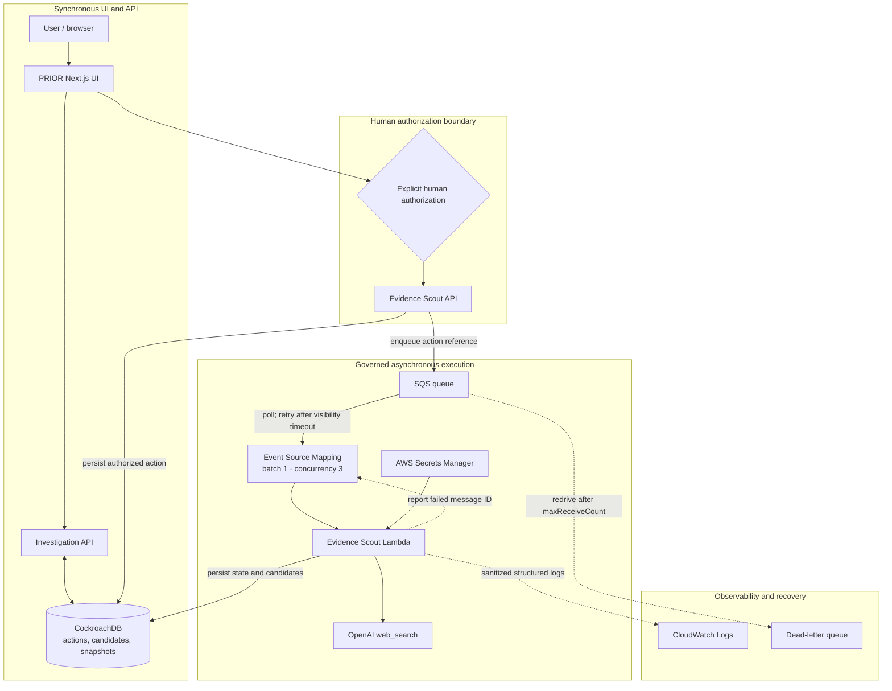

# PRIOR

> **Falsification-driven intelligence, governed by evidence.**

PRIOR is a causal investigation system for high-stakes questions where a plausible answer is not enough. It forces every conclusion to compete with alternatives, exposes missing evidence, proposes the next discriminating test, and preserves a complete audit trail as the investigation evolves.

Most AI systems optimize for a confident response. PRIOR optimizes for a conclusion that has survived an attempt to prove it wrong.

## Why PRIOR

Large language models are excellent at producing coherent explanations. That becomes dangerous when coherence is mistaken for evidence.

PRIOR changes the investigation process itself:

- Evidence is kept separate from interpretation.
- Competing hypotheses remain visible and scored.
- Every hypothesis states what would refute it.
- Missing observations are treated as first-class information.
- The system selects the next test with the greatest discriminating power.
- New evidence updates the investigation without rewriting its history.
- External search requires explicit human authorization.
- Search results never become evidence automatically.

The objective is not to make the model produce a better-sounding answer. It is to make the system **earn confidence**.

## What it does

PRIOR turns an incident or complex event into a structured, evolving investigation:

- **Executive** provides the causal assessment, demonstrated impact, prime suspect, and immediate decision.
- **Investigator** exposes the evidence ledger, timeline, expectation matrix, anomalies, competing hypotheses, confidence scores, missing evidence, and next test.
- **Audit & lineage** preserves case, snapshot, source, model, prompt, precedent, and artifact provenance.
- **Evidence Scout** searches for a specific evidence gap only after human authorization, returns a bounded set of candidates, and requires explicit acceptance before reinvestigation.

## The governed evidence loop

```text
Case evidence
    ↓
Causal assessment and competing hypotheses
    ↓
Highest-value missing evidence gap
    ↓
Explicit human authorization
    ↓
Bounded external search
    ↓
Human candidate review
    ↓
Accepted evidence
    ↓
Versioned reinvestigation with preserved lineage
```

The central rule is simple:

> **Search never becomes evidence automatically.**

## Evidence Scout

Evidence Scout is a governed, asynchronous evidence-acquisition workflow.

1. PRIOR identifies the missing evidence with the greatest potential to reduce uncertainty.
2. A human reviews the proposed search target and explicitly authorizes it.
3. The action is persisted before a reference is dispatched to SQS.
4. A concurrency-limited Lambda performs a bounded OpenAI `web_search`.
5. Candidates are stored in CockroachDB with provenance and rationale.
6. A human accepts or rejects each candidate.
7. Only accepted candidates can enter a follow-up investigation.

Governance is enforced in code:

- maximum two search calls per action;
- maximum five candidates per action;
- daily action budget;
- SQS batch size of one;
- maximum Lambda concurrency of three;
- database-backed claim and idempotency transitions;
- partial batch failures, retries, and DLQ recovery;
- sanitized structured logs that exclude payloads and credentials.

## Architecture



## Live verification

The deployed AWS path was verified end to end on 18 August 2026:

```text
SQS → Lambda → OpenAI web_search → CockroachDB
```

Observed result:

- final state: `completed`;
- search calls: `1` (limit: `2`);
- candidates: `4` (limit: `5`).

This is not a mocked architecture diagram: the governed round trip completed against deployed infrastructure.

## Technology

- **Reasoning:** OpenAI GPT-5.6 with strict Structured Outputs
- **Application:** Next.js, React, TypeScript
- **Validation:** JSON Schema and AJV
- **Persistence:** CockroachDB
- **Async execution:** AWS SQS and Lambda
- **Recovery:** SQS retries and dead-letter queue
- **Secrets:** AWS Secrets Manager
- **Observability:** CloudWatch Logs
- **Infrastructure:** AWS SAM / CloudFormation
- **External evidence:** OpenAI `web_search`

## Investigation model

Each investigation is a validated, versioned snapshot containing:

- observed outcome and expected behavior;
- canonical evidence ledger;
- expectation matrix;
- anomalies and missing observations;
- competing hypotheses with confidence and refutation conditions;
- hypothesis graveyard;
- root-cause assessment;
- missing evidence ranked by information value;
- one next discriminating test;
- learning diff between iterations;
- model, prompt, source, and artifact lineage.

The canonical contract lives in `lib/investigation.schema.json`. Model responses use strict Structured Outputs and are validated server-side before reaching the client.

## Reliability and evaluation

PRIOR treats evaluation artifacts as evidence about the system itself.

- Invalid model responses are rejected by schema validation.
- The engine retries one invalid response before returning a controlled error.
- Semantic evaluations verify that the proposed next test structurally discriminates between hypotheses.
- Local stores are dependency-injected in tests to avoid shared mutable state.
- Queue delivery is idempotent and safe under duplicate or redelivered messages.
- Candidate acceptance and snapshot linking are transactional.

Final validation for this slice:

- 40/40 test files passing;
- full suite repeated three times without concurrency failures;
- TypeScript: PASS;
- ESLint: PASS;
- production build: PASS;
- SAM build and validation: PASS;
- live AWS E2E: PASS.

## Run locally

```bash
npm install
npm run dev
```

Open [http://localhost:3000](http://localhost:3000).

Create an ignored `.env.local` file with the environment variables required by the execution mode you intend to use. Never commit API keys, database URLs, AWS credentials, certificates, or local environment files.

Useful checks:

```bash
npm test
npx tsc --noEmit
npm run lint
npm run build
```

Detailed operational documentation is available in [`docs/evidence-scout.md`](docs/evidence-scout.md).

## Built with Codex + GPT-5.6

PRIOR was developed as a sequence of horizontal, end-to-end slices with explicit acceptance criteria: contract, reasoning, UI, persistence, governed search, cloud execution, observability, and live verification.

Codex was used as the engineering collaborator to implement, test, diagnose, and document each slice. GPT-5.6 powers the investigation engine under a versioned reasoning specification rather than as a conversational wrapper.

## Product thesis

PRIOR is built for investigations where being persuasive is not the same as being correct.

It combines causal reasoning, falsification, human authorization, bounded autonomy, and durable provenance in one system. It does not ask users to trust a confident answer. It gives them a controlled process for deciding when confidence has been earned.
